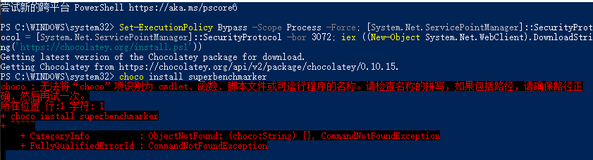
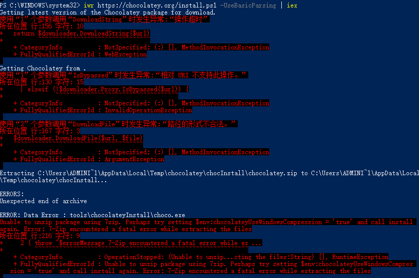
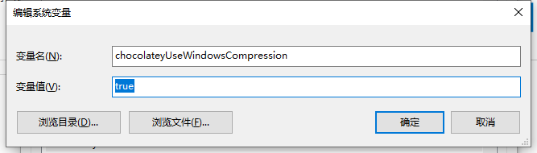
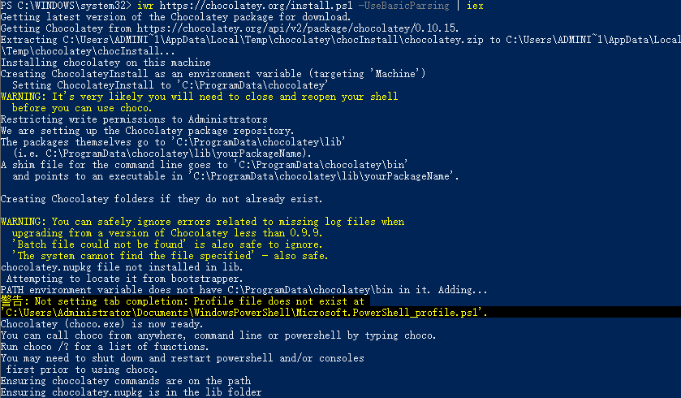
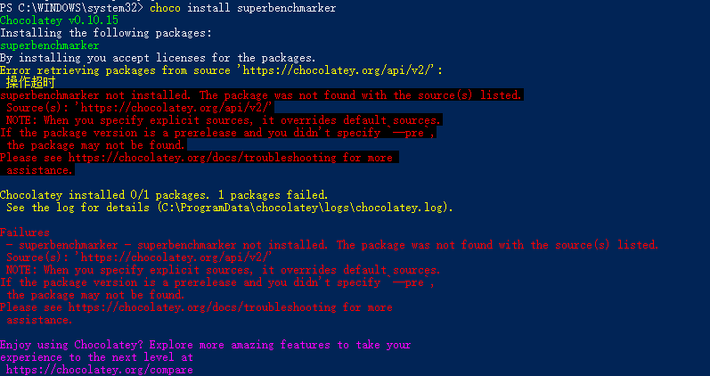
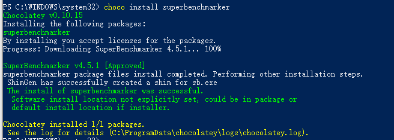
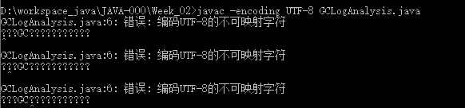

学习笔记

[TOC]

# 环境准备

## Windows

1.管理员身份打开powershell

2.运行

Set-ExecutionPolicy Bypass -Scope Process -Force; [System.Net.ServicePointManager]::SecurityProtocol = [System.Net.ServicePointManager]::SecurityProtocol -bor 3072; iex ((New-Object System.Net.WebClient).DownloadString('https://chocolatey.org/install.ps1'))

3.执行`choco install superbenchmarker`

4.输入 `sb`

执行 `sb -u http://localhost:8088/api/hello -c 20 -N 60`

**实际操作**

- 1 以管理员身份运行powershell

- 2 安装choco后运行`choco install superbenchmarker`出现下面错误

  

- 3 报读后执行`iwr https://chocolatey.org/install.ps1 -UseBasicParsing | iex`，出现下面错误

  

- 4 设置系统环境变量chocolateyUseWindowsCompression = 'true'，

  

  

- 5 再次执行`iwr https://chocolatey.org/install.ps1 -UseBasicParsing | iex` 安装成功

  

- 执行`choco install superbenchmarker`出现下面的错误

  

- 最后翻墙解决安装问题

  

## Mac

1.执行brew install wrk
如果显式brew update很慢，可以ctrl+C打断更新

2.输入 wrk

执行 wrk -t8 -c40 -d60s http://localhost:8088/api/hello

# Week02 第一课

## 1 GC日志解读和分析

```java

import java.util.Random;
import java.util.concurrent.TimeUnit;
import java.util.concurrent.atomic.LongAdder;
/*
演示GC日志生成与解读
*/
public class GCLogAnalysis {
    private static Random random = new Random();
    public static void main(String[] args) {
        // 当前毫秒时间戳
        long startMillis = System.currentTimeMillis();
        // 持续运行毫秒数; 可根据需要进行修改
        long timeoutMillis = TimeUnit.SECONDS.toMillis(1);
        // 结束时间戳
        long endMillis = startMillis + timeoutMillis;
        LongAdder counter = new LongAdder();
        System.out.println("正在执行...");
        // 缓存一部分对象; 进入老年代
        int cacheSize = 2000;
        Object[] cachedGarbage = new Object[cacheSize];
        // 在此时间范围内,持续循环
        while (System.currentTimeMillis() < endMillis) {
            // 生成垃圾对象
            Object garbage = generateGarbage(100*1024);
            counter.increment();
            int randomIndex = random.nextInt(2 * cacheSize);
            if (randomIndex < cacheSize) {
                cachedGarbage[randomIndex] = garbage;
            }
        }
        System.out.println("执行结束!共生成对象次数:" + counter.longValue());
    }

    // 生成对象
    private static Object generateGarbage(int max) {
        int randomSize = random.nextInt(max);
        int type = randomSize % 4;
        Object result = null;
        switch (type) {
            case 0:
                result = new int[randomSize];
                break;
            case 1:
                result = new byte[randomSize];
                break;
            case 2:
                result = new double[randomSize];
                break;
            default:
                StringBuilder builder = new StringBuilder();
                String randomString = "randomString-Anything";
                while (builder.length() < randomSize) {
                    builder.append(randomString);
                    builder.append(max);
                    builder.append(randomSize);
                }
                result = builder.toString();
                break;
        }
        return result;
    }
}
```

- 运行编译命令 `javac -encoding utf-8 GCLogAnalysis.java`

  出现下面的错误，用npp确认文件编码格式是否是utf-8,如果不是转换编码格式后继续编译：

   

  编码格式改为utf-8后继续编译
  
- 

# 作业

## week02_01

- 1、使用GCLogAnalysis.java自己演练一遍串行/并行/CMS/G1的案例

环境：WIN10、JDK8、 512M内存

```
-XX:+UseSerialGC 使用串行GC

-Xms512m 初始堆大小
-Xmx512m 最大堆大小
-Xloggc:serialGC.demo.log 将GC日报保存名为serialGC.demo.log的文件
-XX:+PrintGCDetails 打印GC明细
-XX:+PrintGCDateStamps 打印GC时间戳

```


​	**串行GC**

> `java -XX:+UseSerialGC -Xms512m -Xmx512m  -XX:+PrintGCDetails -XX:+PrintGCDateStamps GCLogAnalysis`


```
def new generation 年轻代
	eden space 新生代
	from space 存货区0
	to   space 存货区1
tenured generation 老年代
Metaspace 元数据
	class space
```

共生成对象次数：5834次，年轻代GC 8次,FullGC 3次，YongGC耗时12~46毫秒，FullGC耗时74~90毫秒，时间是递增的，每次Young区满了才回收

**并行GC**

>java -XX:+UseParallelGC -Xms512m -Xmx512m  -XX:+PrintGCDetails -XX:+PrintGCDateStamps GCLogAnalysis


1秒钟共生成对象次数:5108，发生发生YoungGC 16次，FullGC 2次，YoungGC耗时6~42毫秒，FullGC耗时72~75毫秒

**CMS GC**

> java -XX:+UseConcMarkSweepGC -Xms512m -Xmx512m  -XX:+PrintGCDetails -XX:+PrintGCDateStamps GCLogAnalysis


1秒钟共生成对象次数:7348，发生发生YoungGC 14次，FullGC(CMS GC) 3次，失败2次，YoungGC耗时6~42毫秒，FullGC耗时72~75毫秒


- 2、使用压测工具(wrk或sb)，演练gateway-server-0.0.1-SNAPSHOT.jar示例
- 3、(选座)如果自己本地有可以运行的项目，可以按照2的方式进行演练。

根据上述自己对于1和2的演示，写一段对于不同GC的总结，提交到github

## week02-02

- 1、（可选）运行课上的例子，以及Netty的例子，分析相关现象。

- 2、写一段代码，使用HttpClient或OkHttp访问 http://localhost:8801,代码提交到github

